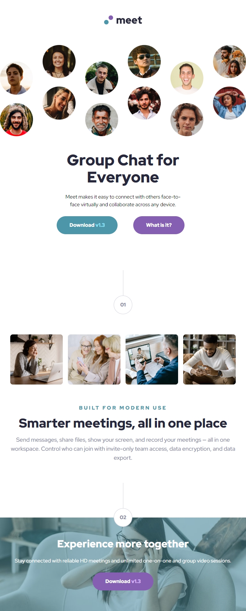
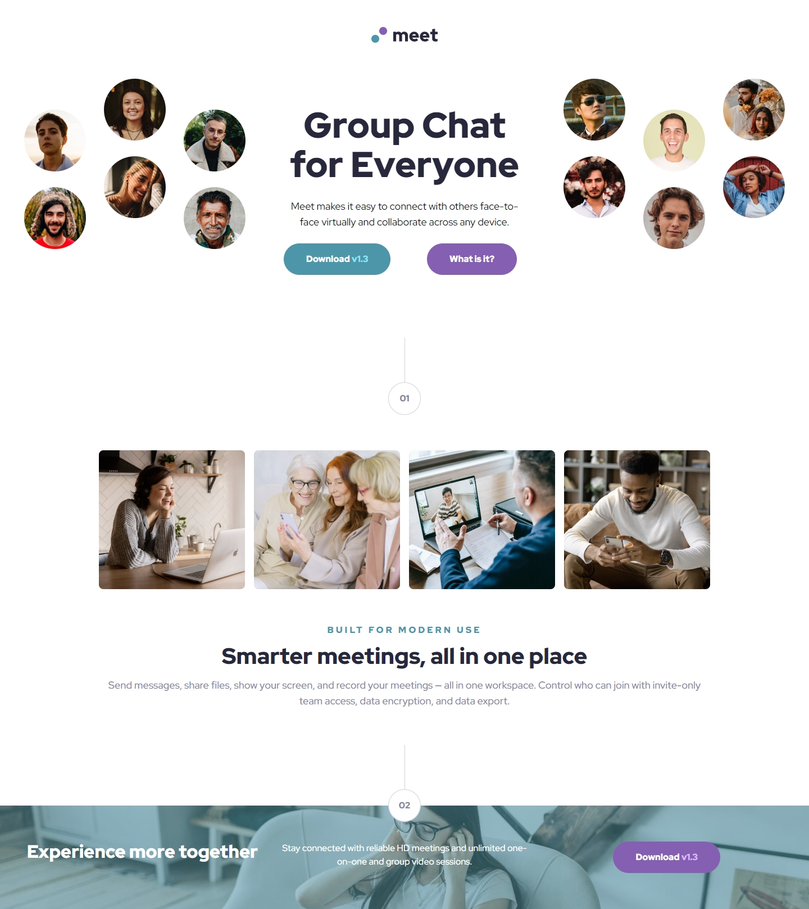

# Meet Landing Page

A responsive landing page built with **React**, **Vite**, and **Tailwind CSS**.  
This project is a solution to the [Frontend Mentor Meet Landing Page Challenge](https://www.frontendmentor.io/challenges/meet-landing-page-rbTDS6OUR).

## LIVE SITE:

[](https://aflamiano-career.github.io/meet-landing-page/)

---

## Table of contents

- [Overview](#overview)
  - [The Feature](#the-feature)
  - [Screenshots](#screenshots)
- [My process](#my-process)
  - [Built with](#built-with)
- [Acknowledgements](#acknowledgements)

---

## Overview

### The Feature

Users should be able to:

- View the optimal layout for the site depending on their device's screen size
- Images should adapt to the device's screen size improving load times

### Screenshots (Click to view larger)

  

---

## Built with

- Semantic HTML5 markup
- CSS custom properties
- Flexbox
- CSS Grid
- Mobile-first workflow
- [React](https://reactjs.org/) - Component-based JS library.
- [Tailwind CSS](https://tailwindcss.com/) - Utility-first CSS framework.
- [Vite](https://vitejs.dev/) - Fast and lean development build tool.
- JavaScript (ES6): Modern JavaScript features and best practices.

#### Sample code

```jsx
<header className="mb-8 sm:mb-20">
  
  <div className="grid lg:grid-cols-3 py-8 justify-items-center">
    <picture>
      <source
        media="(min-width: 64rem)"
        srcSet="assets/desktop/image-hero-left.png"
      />
      
    </picture>
    <div className="mt-12 max-w-md lg:max-w-lg text-center mx-auto">
      <div className="px-8">
        <h1 className="font-black text-[2.5rem] sm:text-5xl lg:text-[4rem] leading-[1.1] text-slate900">
          Group Chat for Everyone
        </h1>
        <p className="my-6 lg:text-lg">
          Meet makes it easy to connect with others face-to-face virtually and
          collaborate across any device.
        </p>
      </div>
      <div className="grid grid-rows-2 gap-2 sm:grid-rows-none sm:grid-cols-2 sm:gap-0 justify-self-center">
        <Button bgColor={"bg-cyan600 hover:bg-cyan600/75"}>
          Download <span className="text-cyan300">v1.3</span>
        </Button>
        <Button bgColor={"bg-purple600 hover:bg-purple600/75"}>
          What is it?
        </Button>
      </div>
    </div>
    <picture>
      <source
        media="(min-width: 64rem)"
        srcSet="assets/desktop/image-hero-right.png"
      />
      
    </picture>
  </div>
</header>
```

---

## Acknowledgements

- [Frontend Mentor](https://www.frontendmentor.io/) for the challenge and design inspiration.
- [Google Fonts - Red Hat Display](https://fonts.google.com/specimen/Red+Hat+Display)

---
